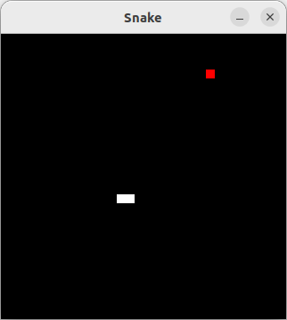

# nessie

NES emulator in Rust, based on the tutorial at [https://bugzmanov.github.io/nes_ebook/](https://bugzmanov.github.io/nes_ebook/). For now, it only implements the CPU, with:

- Memory map and registers
- Status flags
- Full 6502 instruction set
- Addressing modes

Programs are loaded from an array of bytes and then run with a callback to a function on each CPU cycle; this is used for rendering to a window with SDL2.